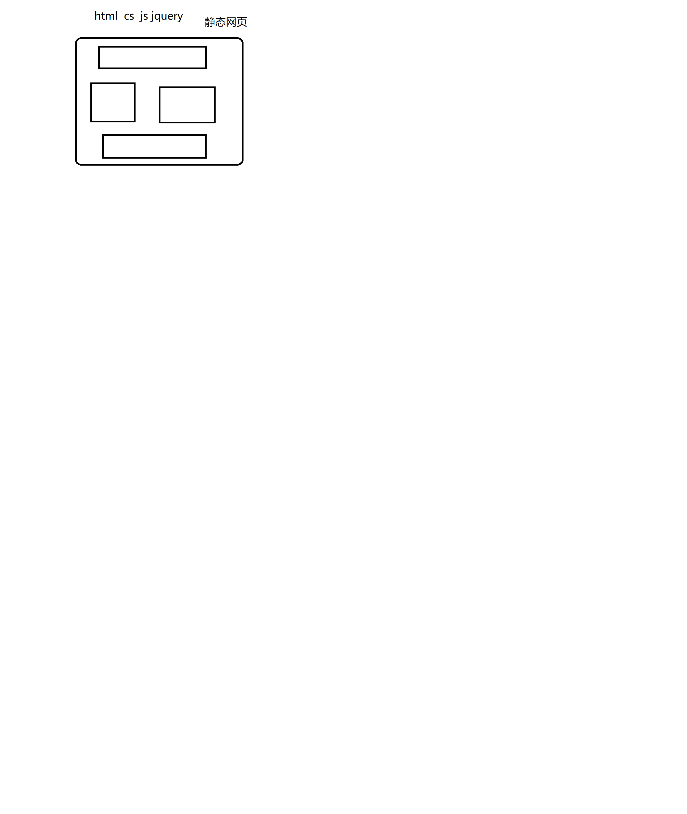
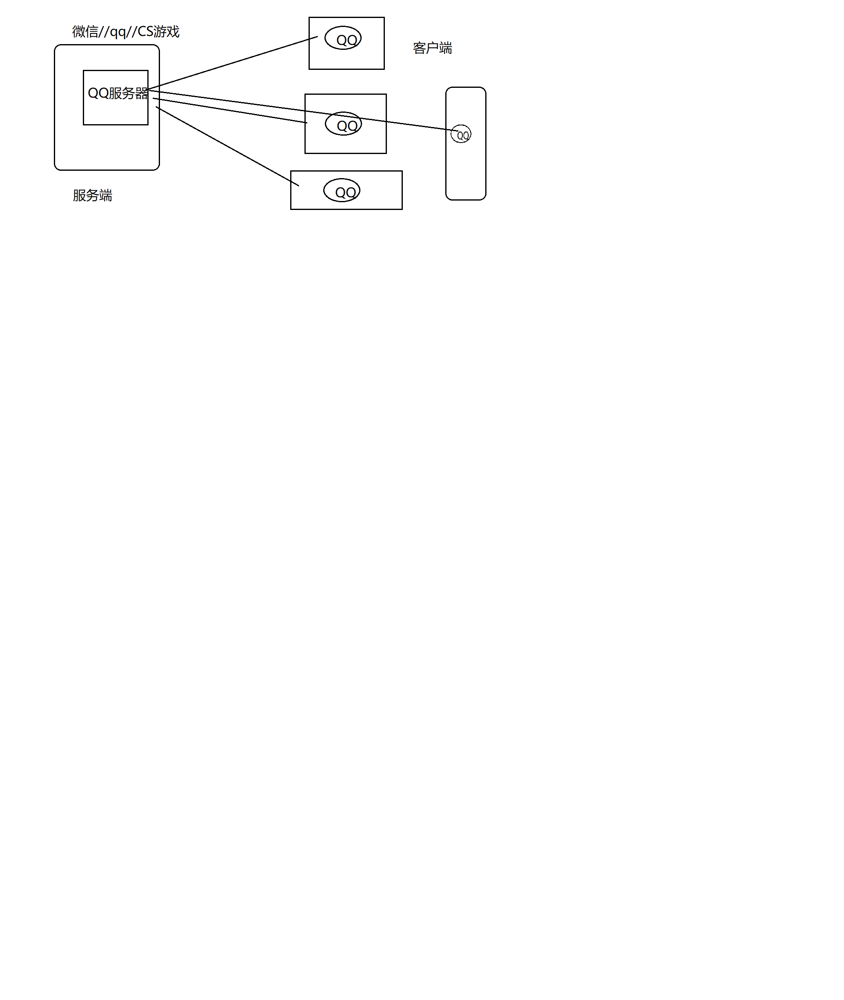
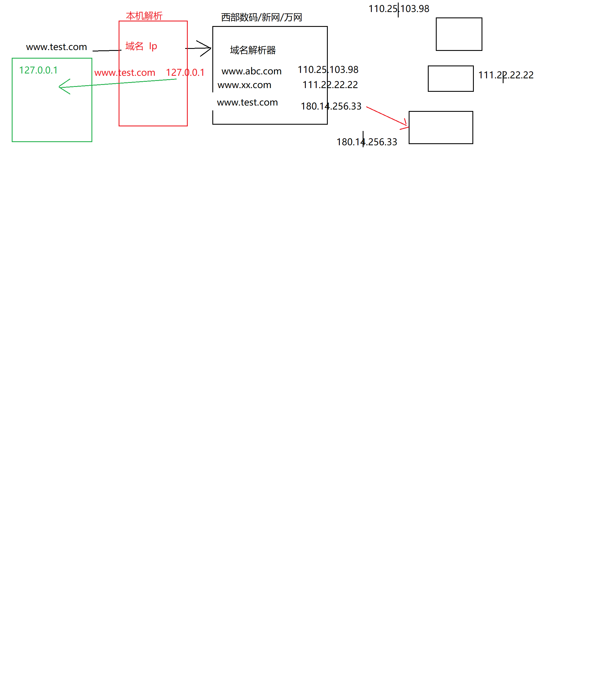
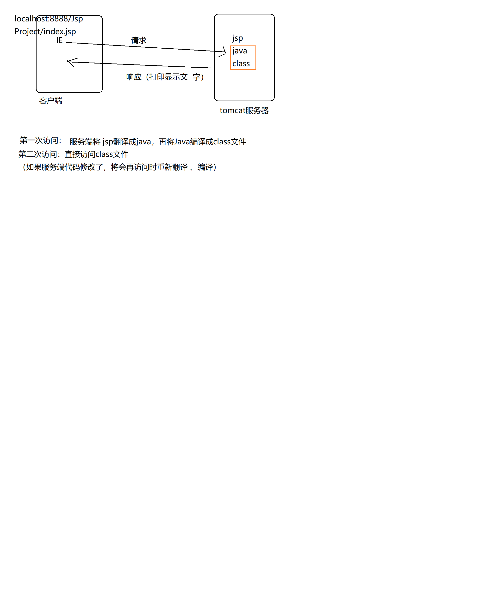

## 1JSP:动态网页

**静态、动态**：
1.不用 和 是否有“动感”混为一谈  
2.是否 随着 时间、地点、用户操作  的 改变而改变

动态网页 需要使用到 服务端脚本语言（JSP）




## 2架构
#### CS：Client Server<br>
CS不足：<br>
+ a.如果 软件升级， 那么全部软件都需要升级
+ b.维护麻烦：需要维护每一台 客户端软件
+ c.每一台客户端 都需要安装 客户端软件




#### BS ：Broswer Server
客户端可以通过 浏览器  直接访问服务端 


注意：bs和cs各有优势。


## 3.tomcat解压后目录：
+ bin:可执行文件（startup.bat    shutdown.bat）
+ conf:配置文件（server.xml）
+ lib：tomcat依赖的jar文件
+ log:日志文件（记录出错等信息）
+ temp:临时文件
+ webapps：可执行的项目（将我们开发的项目 放入该目录）
+ work:存放由jsp翻译成的java,以及编辑成的class文件(jsp  ->java ->class)

## 4.配置tomcat
+ a.配置jdk  (必须配置JAVA_HOME)
java_home  classPath  path
+ b.配置catalina_home

双击bin/startup.bat启动tomacat，<br>
**常见错误**： 可能与其他服务的端口号冲突
tomcat端口号默认8080 （此端口号较为常见，容易冲突），建议修改此端口 （8888）

## 5.访问tomcat
http://localhost:8888/

常见状态码：

状态码|描述
---|:--:
200|一切正常
300/301|页面重定向 （跳转）
404|资源不存在 
403|权限不足 （如果访问a目录，但是a目录设置 不可见）
500|服务器内部错误（代码有误）

jsp：在html中嵌套的java代码 

 在项目/WEB-INF/web.xml中设置 默认的 初始页面
 ```JSP
     <welcome-file-list>

        <welcome-file>index.jsp</welcome-file>
    </welcome-file-list>
```

## 6.虚拟路径
+ a.方式一:
将web项目配置到 webapps以外的目录
conf/server.xml中配置
host标签中：
```JSP
<Context  docBase="D:\study\JspProject"  path="/JspProject"   />
```
docBase：实际路径 <br>
path：虚拟路径  （绝对路径、相对路径【相对于webapps】）<br>
重启<br>

+ b.方式二
D:\study\apache-tomcat-8.5.30\conf\Catalina\localhost
中新建   “项目名.xml”中新增一行：
```
<Context  docBase="D:\study\JspProject"  path="/JspProject"   />
```

## 7.虚拟主机
通过www.test.com访问本机
a. conf/server.xml
```
  <Engine name="Catalina" defaultHost="www.test.com">
  
	  <Host appBase="D:\study\JspProject" name="www.test.com">
			<Context docBase="D:\study\JspProject"   path="/"/>
	  </Host>
```
b.C:\Windows\System32\drivers\etc\host
增加
```
127.0.0.1       www.test.com
```

流程：<br>
www.test.com -> host找映射关系 ->server.xml找Engine的defaultHost ->通过"/"映射到D:\study\JspProject





## 7.JSP执行流程
jsp- java(Servlet文件) -class
D:\study\apache-tomcat-8.5.30\work\Catalina\localhost\JspProject\org\apache\jsp




<br>
Jsp 和Servlet 可以相互转换  


因为第一请求服务端 会有翻译 和编译的过程，因此比较慢； 后续访问 可以直接访问class,因此速度较快。但是 如果 服务端修改了代码，则再次访问时  会重新的翻译、编译。


