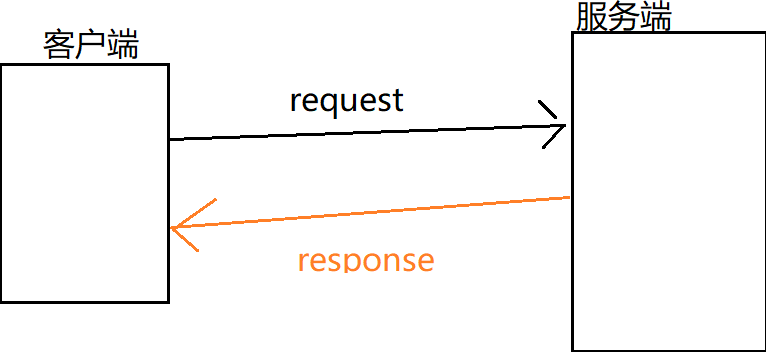
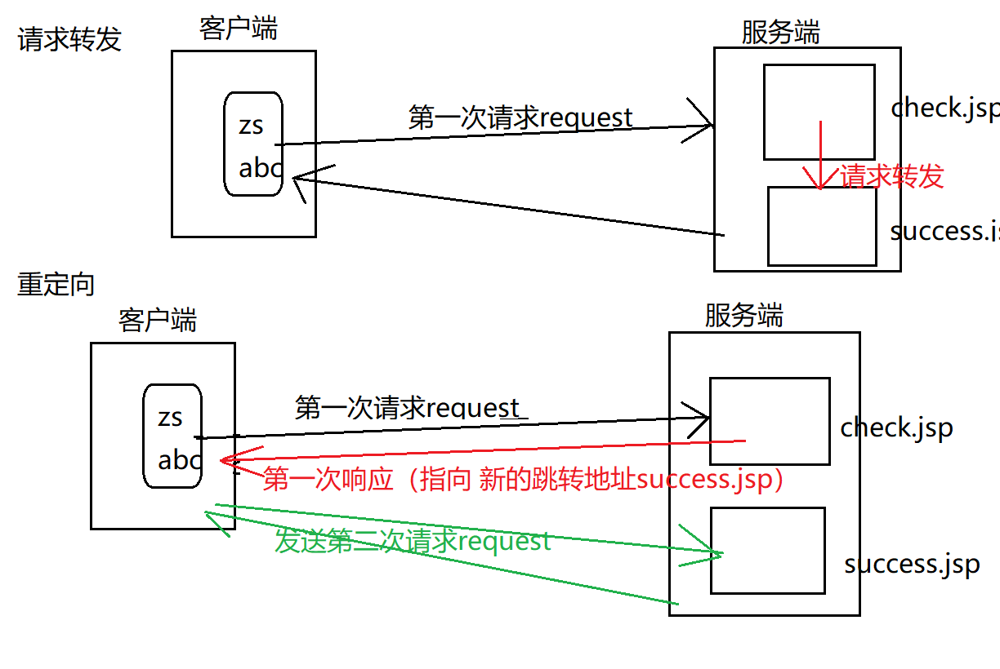
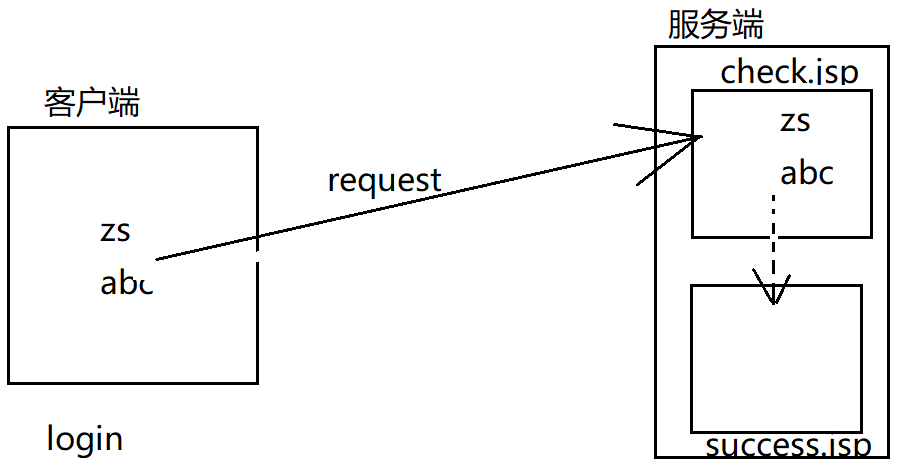

## response :响应对象
提供的方法：<br>
+ void addCookie( Cookie cookie ); 服务端向客户端增加cookie对象
+ void sendRedirect(String location ) throws IOException; :页面跳转的一种方式（重定向）
+ void setContetType(String type):设置服务端响应的编码（设置服务端的contentType类型）



示例：登陆
login.jsp  -> check.jsp  ->success.jsp

login.jsp
```JSP
<%@ page language="java" contentType="text/html; charset=UTF-8"
    pageEncoding="UTF-8"%>
<!DOCTYPE html>
<html>
<head>
<meta charset="UTF-8">
<title>Insert title here</title>
</head>
<body>
	<form action="check.jsp" method="post">
		用户名:<input type="text" name="uname"><br>
		密码:  <input type="password" name="upwd"><br>
		<input type="submit" value="登陆">
	</form>
</body>
</html>
```
check.jsp
```JSP
<%@ page language="java" contentType="text/html; charset=UTF-8"
    pageEncoding="UTF-8"%>
<!DOCTYPE html>
<html>
<head>
<meta charset="UTF-8">
<title>Insert title here</title>
</head>
<body>
	<%
		request.setCharacterEncoding("UTF-8");  //设置编码
		String name=request.getParameter("uname");
		String pwd=request.getParameter("upwd");
		if(name.equals("abc") && pwd.equals("123")){
			//response.sendRedirect("success.jsp");  导致数据丢失  重定向
			request.getRequestDispatcher("success.jsp").forward(request,response);
		}else{
			out.print("用户名和密码错误");
		}
	%>
</body>
</html>	
```
success.jsp
```JSP
<%@ page language="java" contentType="text/html; charset=UTF-8"
    pageEncoding="UTF-8"%>
<!DOCTYPE html>
<html>
<head>
<meta charset="UTF-8">
<title>Insert title here</title>
</head>
<body>
	登陆成功！<br>
	<%
		String name=request.getParameter("uname");
		out.print("姓名："+name);
	%>
</body>
</html>
```
请求转发和重定向的比较


比较|请求转发	重定向
---|:--:
地址栏是否改变|不变(check.jsp)|改变(success.jsp)
是否保留第一次请求时的数据|保留|不保留--4种范围对象
请求的次数|1|2
跳转发生的位置|服务端|客户端发出的第二次跳转

```
转发、重定向：

转发：  
	张三（客户端）     ->    【 服务窗口 A （服务端 ）    ->  服务窗口B  】


重定向：
	张三（客户端） 	  -> 	服务窗口 A （服务端 ） ->去找B

	张三（客户端）    -> 	服务窗口 B （服务端 ） ->结束
```
请求次数问题示例图<br>



<br>
请求转发与重定向<br>


## 2.session(服务端)
Cookie（客户端，不是内置对象）:Cookie是由 服务端生成的 ，再发送给客户端保存。<br>
相当于 本地缓存的作用： 客户端(hello.mp4,zs/abc)->服务端(hello.mp4；zs/abc)<br>
**作用**：提高访问服务端的效率，但是安全性较差。

Cookie：	name=value <br>  
javax.servlet.http.Cookie<br>

方法|描述
---|:--:
public Cookie(String name,String value)|创建一个Cookie对象
String getName()|获取name
String getValue()|获取value
void setMaxAge(int expiry)|最大有效期 （秒）

服务端准备Cookie：<br>
+ response.addCookie(Cookie cookie)

页面跳转（转发，重定向）<br>
+ 客户端获取cookie:  request.getCookies();

a.服务端增加cookie :response对象；客户端获取对象：request对象
b.不能直接获取某一个单独对象，只能一次性将 全部的cookie拿到

通过F12可以发现  除了自己设置的Cookie对象外，还有一个name为 JSESSIONID的cookie

建议 cookie只保存  英文数字，否则需要进行编码、解码

## 3.session :会话
a.浏览网站：开始-关闭
b.购物：  浏览、付款、退出
c.电子邮件：浏览、写邮件、退出
	开始-结束


session机制：

客户端第一次请求服务端时，（jsessionid-sessionid）服务端会产生一个session对象（用于保存该客户的信息）； 
并且每个session对象 都会有一个唯一的 sessionId( 用于区分其他session);
服务端由会 产生一个cookie，并且 该cookie的name=JSESSIONID ,value=服务端sessionId的值；
然后 服务端会在 响应客户端的同时 将该cookie发送给客户端，至此 客户端就有了 一个cookie(JSESSIONID)；
因此，客户端的cookie就可以和服务端的session一一对应（JSESSIONID - sessionID）

客户端第二/n次请求服务端时:服务端会先用客户端cookie种的JSESSIONID  去服务端的session中匹配sessionid,如果匹配成功（cookie  jsessionid和sesion sessionid），说明此用户 不是第一次访问,无需登录；


例子：
客户端：		    顾客（客户端）
服务端: 存包处   -  商场(服务端)

顾客第一次存包：商场 判断此人是 之前已经存过包（通过你手里是否有钥匙）。
 如果是新顾客（没钥匙） ，分配一个钥匙 给该顾客； 钥匙 会和 柜子 一一对应；

 第二/n次 存包：商场 判断此人是 之前已经存过包（通过你手里是否有钥匙）
 如果是老顾客（有钥匙），则不需要分配；该顾客手里的钥匙 会 和柜子 自动一一对应。
 


